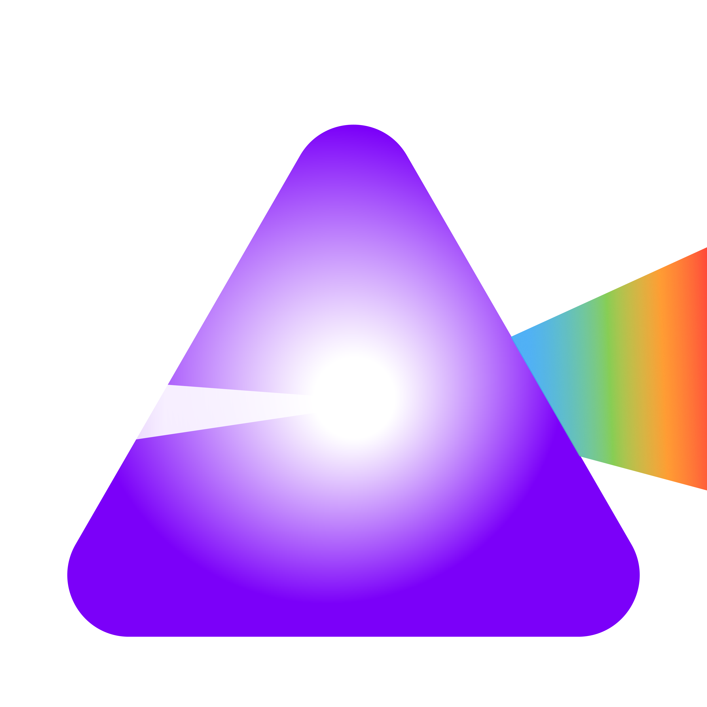

# Prism

A desktop app that bridges your DMX lighting console to Philips Hue lights over your local network. Send Art-Net or sACN (E1.31) from any console or software and control real Hue bulbs in real time — with show-safe pacing, automatic recovery, and Stream Deck integration.


---

## Features

### DMX → Hue engine
- **Art-Net & sACN (E1.31)** — listen on either protocol or both simultaneously, with configurable universes and per-universe multicast handling.
- **Adaptive command pacing** — the Hue bridge sustains only ~10 commands/sec, so Prism budgets intelligently: small rigs get faster per-light updates (smoother fades), large rigs get safe pacing, and jitter from the console is filtered out so a held level never floods the bridge.
- **Smart transitions** — snap cues fire instantly with a quick ramp, sustained fades ride a transition that exactly covers the gap to the next update (one continuous glide, not step-and-hold), and blackouts cut with zero transition. Blackout and lights-up cues bypass the tick cycle entirely and fire the moment the DMX frame arrives.
- **Fixture personalities** — patch each light as **Color** (3ch: R, G, B), **Tunable White** (2ch: Intensity, Color Temp), or **Dimmer** (1ch: Intensity). White-ambiance and dimmable bulbs get native control instead of an RGB approximation.
- **Per-light DMX patch** — custom start channel and universe per light, independent of the global start address. Sequential addressing adapts to each fixture's footprint automatically.
- **Multi-universe support** — lights patched to different universes all receive correctly in one listener session; Prism joins the right sACN multicast groups automatically.

### Reliability
- **Automatic bulb recovery** — if a bulb drops off the Zigbee mesh, Prism quarantines it (so retries can't stall the bridge and knock *other* bulbs offline), probes it gently while the rig is idle, and resumes control the moment it returns. Unreachable bulbs are clearly badged in the UI.
- **Listener auto-resume** — if the machine reboots, Prism starts back up listening. No window, no clicks.
- **Bridge health check & auto-reconnect** — a background check keeps the session alive and silently reconnects if the bridge restarts or moves.
- **Bridge restart** — a last-resort maintenance action that reboots the Hue bridge and rides out the offline window with automatic reconnection.
- **Single-instance lock** — a second copy of Prism exits immediately instead of double-driving your bulbs.
- **Auto-updates** — Prism checks GitHub for new releases every few hours and pops a native dialog even when running in the tray. Prompts wait until DMX is idle, so nothing interrupts a show.

### Control & monitoring
- **Smart-home style Control tab** — an *All Lights* master row (color presets, master dimmer, All On / All Off), per-light cards with toggle, brightness, and an inline color palette, plus a select mode for controlling groups of lights at once.
- **Scene cards** — save the current look as a scene, recall it with one click, **update it in place** (↻) as your look evolves, and delete with a two-click confirm. Cards are tinted with the scene's own colors.
- **Rig-wide blackout in one command** — All Off and PANIC use a single Hue group command (one Zigbee groupcast) instead of per-bulb sends. Instant, everywhere.
- **Live Monitor** — per-channel level meters, signal status, sACN diagnostics (tells you exactly which universe is arriving vs. configured), and a rolling **event log** of bulb drops, recoveries, reconnects, and listener changes.
- **Light management** — scan for new bulbs (40-second Zigbee inclusion window) with an explicit *+ Add* flow, rename, set fixture mode, and delete — all without leaving Prism.

### Workflow
- **Show profiles** — export your entire rig setup (patch, fixture modes, scenes, control state, bridge pairing) as one file and restore it on any machine from Settings.
- **Bitfocus Companion integration** — Stream Deck buttons for presets, All Off, and PANIC, with live feedbacks (bridge status, active preset, DMX activity, unreachable bulbs) and variables.
- **Menu bar / tray app** — closing the window doesn't stop the listener. Supports **Launch at Login** for unattended operation.
- **Cross-platform** — macOS, Windows, and Linux.

---

## Download

Pre-built installers are available on the [Releases](https://github.com/YoshiBowman/Prism/releases) page:

| Platform | File |
|----------|------|
| macOS (Apple Silicon + Intel) | `.dmg` |
| Windows | `.exe` (NSIS installer) |
| Linux | `.AppImage` or `.deb` |

Once installed, Prism keeps itself up to date automatically.

---

## Running from Source

### Requirements

- [Node.js](https://nodejs.org) v18 or later
- npm (comes with Node.js)

### Setup

```bash
git clone https://github.com/YoshiBowman/Prism.git
cd Prism
npm install
npm start
```

---

## Building Installers

```bash
npm run build:mac    # → dist/Prism-*.dmg
npm run build:win    # → dist/Prism-*.exe
npm run build:linux  # → dist/Prism-*.AppImage  +  .deb
```

The Companion module is built separately:

```bash
cd companion-module
npm install
npm run build        # bundles src/index.js → main.js
```

---

## Setup Guide

### 1. Connect to your Hue Bridge

1. Launch Prism and go to the **Bridge** tab.
2. Click **Scan Network** — the app searches via ARP, SSDP, mDNS, portal lookup, and subnet scan.
3. When your bridge appears, click **Connect**.
4. A centered prompt appears — **press the round link button on top of your physical Hue Bridge** within 30 seconds.
5. The app pairs and loads your lights.

> **Bridge not found?** The scan can only search subnets this computer can see — a bridge on a different VLAN won't announce itself. Enter its IP in the **Manual IP** field (reliable whenever the bridge is routable), or add its subnet in **Additional Subnet** and re-scan. Once connected, Prism remembers the address and finds it instantly next time.

### 2. Patch your lights

1. Go to the **Lights** tab and click **↻ Refresh**.
2. Drag lights into the order you want. Sequential addressing starts at the DMX start address and advances by each fixture's channel footprint.
3. Use the toggle on each row to enable or disable a light in the DMX mapping.
4. Click the **⋯** options button on a row to:
   - set a **custom start channel and/or universe** (patched fields turn purple),
   - choose the **Fixture Mode** — Color (3ch), Tunable White (2ch), or Dimmer (1ch),
   - **rename** the light on the bridge,
   - **delete** the light from the bridge (two-click confirm).

### 3. Find new bulbs

Click **+ Find New Lights** to open a 40-second Zigbee inclusion window. Discovered bulbs appear with an explicit **+ Add** button — renaming is optional and separate. New bulbs are controllable immediately, no restart needed.

### 4. Configure the listener

Use the **listener bar** at the top of the app (always visible):

| Control | Description |
|---------|-------------|
| Protocol | `Art-Net`, `sACN (E1.31)`, or `Both` |
| Default Univ. | Universe number for the selected protocol |
| ▶ Start | Start listening for DMX packets |
| ■ Stop | Stop the listener |

The listener state persists — if Prism (or the whole machine) restarts, it resumes listening automatically.

Additional options (bind interface, DMX start address, manual-control fade time) are in the **Settings** tab.

### 5. Configure your console / software

Point your DMX console or software at the machine running Prism:

**Art-Net**
- Destination IP: the machine running Prism (or broadcast `255.255.255.255`)
- Universe: must match the app's Art-Net universe (default: 0)
- Port: 6454

**sACN / E1.31**
- Send to multicast group `239.255.X.Y` (encodes the universe) or unicast to the machine's IP
- Universe: must match the app's sACN universe (default: 1)
- Port: 5568

> **Multi-universe setups:** lights patched to other universes just work — Prism joins the right multicast groups automatically.

### 6. DMX channel layout

Each light's footprint depends on its **Fixture Mode**:

| Mode | Channels | Layout |
|------|----------|--------|
| Color (default) | 3 | +0 Red · +1 Green · +2 Blue |
| Tunable White | 2 | +0 Intensity · +1 Color Temp (0 = cold → 255 = warm) |
| Dimmer | 1 | +0 Intensity |

Sequential patching is cumulative: with start address **1**, an RGB light, then a Tunable White, then a Dimmer occupy channels 1–3, 4–5, and 6. Custom per-light patches override a light's own position without shifting its neighbours.

### 7. Control tab

- **All Lights row** — master color presets and dimmer act on the lights that are on; **All On / All Off** switch the whole rig (All Off is a single instant group command).
- **Scenes** — big tappable cards tinted with the scene's colors. Click to apply, hover for **↻** (update the scene to the current look) and **✕** (delete) — both double-click-confirmed.
- **Light cards** — toggle, brightness slider (dragging while off wakes the light), and an inline color palette with a custom picker. Picking a color turns the light on.
- **Select mode** — tap *Select*, tap cards to group them, then drive color/brightness/on/off for the whole selection at once.
- When DMX is active, the control surface locks and shows live DMX colors; manual control resumes 2 s after the last DMX packet.

### 8. Monitor tab

- Per-light channel meters and live color swatches.
- Signal bar: green pulsing dot while packets arrive, protocol and universe display.
- sACN diagnostics: if the console is sending a universe Prism isn't watching, the banner says exactly what's arriving.
- **Event log**: a rolling history of bulb drops/recoveries, bridge reconnects, listener changes, and panic events — your first stop when something misbehaved during a show.

### 9. Menu bar / tray operation

Prism runs as a menu bar (tray) app. Closing the main window does **not** stop the listener. Enable **Launch at Login** (Settings) for fully unattended operation: at boot, Prism starts hidden, reconnects to the bridge, and resumes listening by itself.

Update prompts appear as native dialogs even with no window open — and they wait until DMX has been idle, so nothing pops mid-show.

---

## Bitfocus Companion Integration

Prism runs a local HTTP API on port **38765** for Bitfocus Companion, giving you Stream Deck buttons for presets, blackouts, and rig status.

> **Note:** The Prism module is not in the official Companion registry — install it manually as an offline module. Match the module version to your Prism version.

### Installing the Companion module

1. **Download** `companion-module-prism-X.X.X.tgz` from the [Releases](https://github.com/YoshiBowman/Prism/releases) page.
2. In Companion, go to the **Modules** page and click **Import module package**, then select the `.tgz`.
3. Go to **Connections → Add connection** and search for **Prism**.
4. Set **Host** to the IP of the machine running Prism (`localhost` if it's the same machine) and **Port** to `38765`.
5. Save — Companion connects and loads your presets automatically. Ready-made buttons (every preset, All Off, PANIC, Bridge Status) appear in the preset library.

### Actions

| Action | Description |
|--------|-------------|
| Apply Preset | Recalls a named scene from the Control tab |
| All Lights Off | Turns off every light (one group command) |
| PANIC — Instant Blackout | Rig-wide blackout with zero transition |

### Feedbacks

| Feedback | Description |
|----------|-------------|
| Preset Is Active | Highlights a button while its preset is the active one |
| Prism Connected To Bridge | Green while the bridge session is live |
| DMX Listener Running | Lit while the listener is running |
| DMX Signal Active | Lit while DMX frames are arriving |
| Any Bulb Unreachable | Red the moment any bulb drops off the mesh |

### Variables

`$(prism:bridge)` · `$(prism:active_preset)` · `$(prism:dmx_active)` · `$(prism:listening)` · `$(prism:unreachable)` · `$(prism:preset_count)` · `$(prism:prism_version)`

### HTTP API

Any HTTP-capable controller can drive Prism directly:

| Endpoint | Method | Description |
|----------|--------|-------------|
| `/api/status` | GET | Connection, presets, DMX state, unreachable count, version |
| `/api/presets` | GET | List preset names |
| `/api/presets/{name}/apply` | POST | Apply a preset |
| `/api/lights/all/off` | POST | All lights off |
| `/api/panic` | POST | Instant blackout |

---

## Show Profiles

**Settings → Show Profile → Export…** saves your entire rig configuration — patch, fixture modes, scenes, control-tab state, and bridge pairing — to a single JSON file. **Import…** restores it on any machine and reconnects to the bridge automatically.

> The profile contains your bridge API key. Treat the file like a password.

---

## Troubleshooting

**Bridge not found during scan**
- The scan only covers subnets this computer can see. If the bridge is on another VLAN/subnet, use **Manual IP** — it connects directly and works whenever the bridge is routable.
- Find the bridge IP in the Hue app under *Settings → My Hue system → Philips Hue*.
- With multiple network adapters, pick the right one in **Search via Interface**, or add the bridge's subnet in **Additional Subnet**.

**Lights not responding to DMX**
- Confirm the listener is running (green badge in the title bar).
- Check the Monitor tab — if bars move, DMX is arriving; if not, check the console's output IP and universe.
- Check the light's fixture mode — a Tunable White light listens on 2 channels, not 3, which shifts every sequential address after it.

**A bulb shows UNREACHABLE**
- Prism detected the bulb dropped off the Zigbee mesh (power cut, out of range). It's quarantined automatically so retries can't stall the rest of the rig, and probed while the rig is idle.
- Restore power and it recovers on its own within ~30 seconds — watch the Monitor tab's event log for the recovery entry.

**Lights going unreachable during shows**
- Almost always a saturated Zigbee radio. Check for a second copy of Prism running (the app prevents this on the same machine, but not across machines), or another Hue controller hammering the bridge.
- The event log (Monitor tab) timestamps every drop so you can correlate with what was happening in the show.

**sACN not receiving**
- Check the Monitor tab's diagnostic banner — it reports the universe actually arriving vs. the ones Prism is watching.
- If universes match but nothing arrives, try disabling **sACN Multicast** (Settings) to use unicast.
- Make sure UDP port 5568 isn't blocked by a firewall.

**Colors look wrong**
- Hue color bulbs use HSB; Prism converts RGB automatically. Very low RGB values can look off — try values above 20.
- White-only and ambiance bulbs shouldn't be driven as RGB at all — set their **Fixture Mode** to Dimmer or Tunable White in the light's ⋯ options.

**Fades look stepped**
- Prism paces commands to what the bridge can sustain and bridges the gaps with matched transition times. Small rigs (few bulbs) automatically get faster update rates and smoother fades.
- Very fast fades will always quantize somewhat — Hue bulbs have a finite update rate. For snap cues this doesn't matter: they're sent the instant they arrive.

---

## License

MIT
